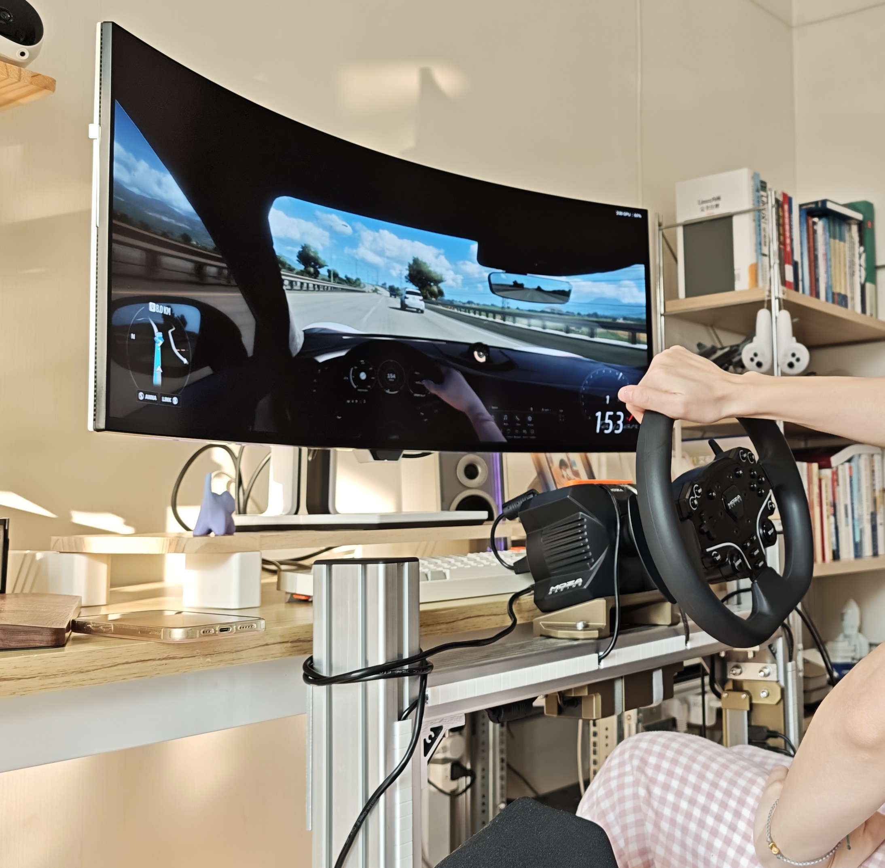
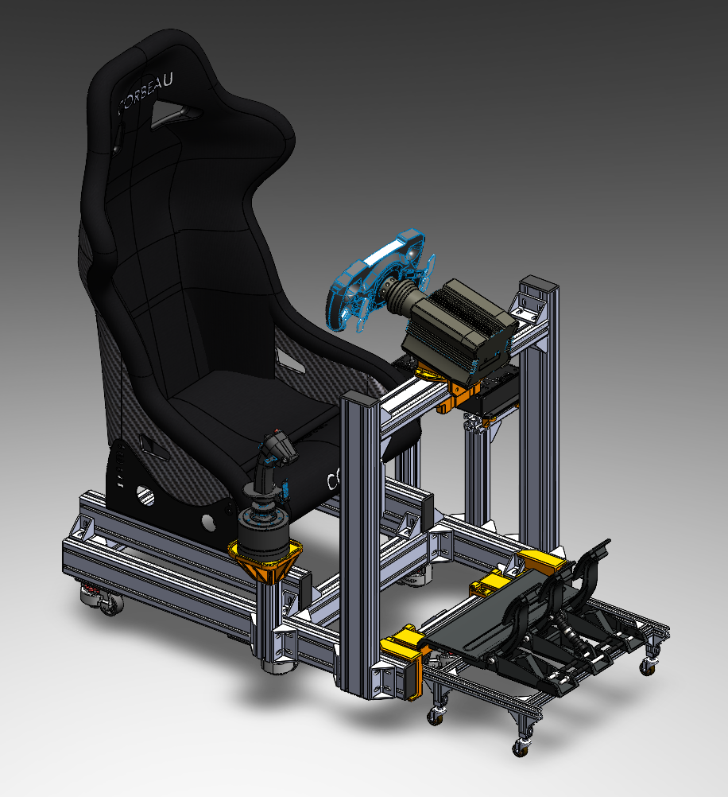
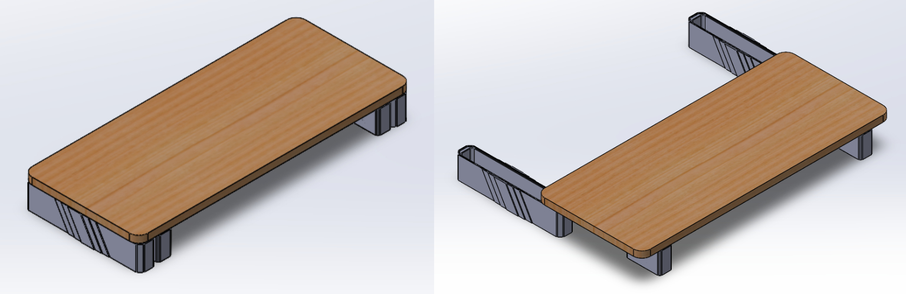

# MyCockpit  

## 1.紧凑型模拟驾驶座舱

​	这是一种为模拟赛车/飞行爱好者打造的低成本、紧凑型、模块化模拟驾驶座舱。本项目最大的特点在于设计了一种可更换的脚踏模块，可以快速切换赛车模式与飞行模式。通过集成化的整体设计，省去了分体式的复杂设置过程，帮助用户快速启动/撤收，让你的紧张生活不在焦虑。

## 2.滑动显示器支架

​	使用模拟座舱后，正常的显示器摆放位置距离玩家过远，为了解决这个问题，我设计了一个可以在桌面上滑动的显示器支架，并且通过在轨道上设计凹坑来实现位置自锁。

​	本项目提供原始模型，你可以在这些模型的基础上轻松定制自己的方案！

